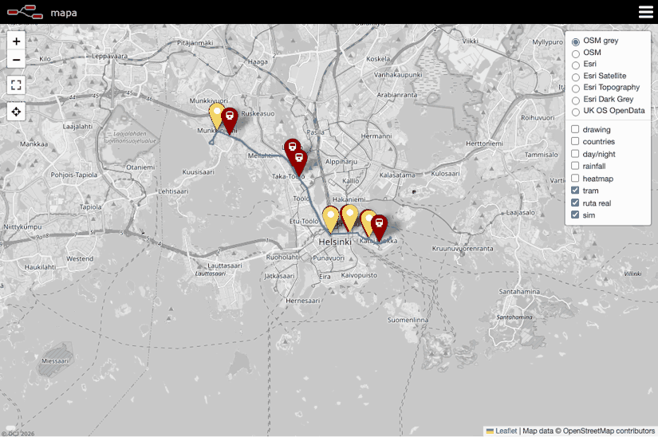

<div align="center">

# Flota HSL

**Seguimiento, simulación y predicción de llegada en Helsinki**

[](https://grafana.com/)
[](https://nodered.org/)
[](https://docs.influxdata.com/influxdb/v2/)
[](https://mosquitto.org/)

[Memoria en PDF](docs/memoria.pdf) · [Puesta en marcha](docs/puesta-en-marcha.md) · [Resultados](docs/resultados.md)

</div>

Un sistema que recibe las posiciones de la línea 4 de Helsinki, comprueba sus datos y sigue cada tranvía sobre el mapa. El histórico permite consultar retrasos en Grafana, combinar meteorología y puntualidad para el plan de invierno y comparar una predicción de llegada con una estimación basada en distancia y velocidad.

## El mapa en funcionamiento



Grabación del laboratorio del 30 de septiembre de 2026. Los marcadores reales reciben HSL y los naranjas pertenecen al simulador. La grabación conserva unos treinta segundos del laboratorio y se repite automáticamente.

## Del mensaje al panel

HSL publica posiciones y eventos por MQTT. Node-RED valida y normaliza los mensajes, distribuye el estado mediante Mosquitto y actualiza Worldmap e InfluxDB. Grafana consulta el histórico. Open-Meteo aporta el contexto meteorológico y un servicio Python ejecuta el modelo LightGBM y evalúa sus predicciones al recibir las llegadas.


| Seguimiento | Plan de invierno | Predicción de llegada |
| --- | --- | --- |
| Posiciones, velocidad y estado de cada vehículo | Decisión según nieve prevista y evolución del retraso | Comparación del modelo con una línea base cinemática |
| Validación, mensajes retenidos y almacenamiento temporal | Comprobación de ventanas completas y datos vigentes | Evaluación por horizonte, viaje, parada y estado de marcha |
| [Contrato MQTT](docs/contrato-mqtt.md) | [Diagrama de la decisión](docs/diagrams/plan-invierno.svg) | [Diagrama de evaluación](docs/diagrams/evaluacion-eta.svg) |

## Una flota donde probar decisiones

El simulador reconstruye la ruta observada, reproduce marcha y paradas y compara nieve, cortes y refuerzos. La regla de retención consulta la regularidad antes de actuar y solo envía órdenes a vehículos simulados. Las posiciones sintéticas quedan separadas de HSL, del plan de invierno y del ETA.


La observación en vivo reunió cuatro parejas durante treinta minutos. Los ensayos pareados muestran que retener más tiempo puede empeorar la regularidad; no identifican un óptimo económico sin datos de pasajeros. La [simulación completa](docs/simulacion.md) reúne S1–S5, figuras, parámetros y resultados.

## Resultados de la comparación

La ventana del 29 de septiembre reúne **20 786 predicciones**. El MAE expresa el error absoluto medio en segundos; un valor menor indica una estimación más cercana a la llegada observada.

| Casos evaluados | Línea base | Modelo |
| --- | --- | --- |
| Conjunto de la ventana | 29,39 s | 15,89 s |
| En marcha, a menos de 30 s de llegar | 3,98 s | 11,62 s |

El modelo reduce el error global de esta ventana, pero la línea base funciona mejor en el grupo más numeroso, cerca de la llegada y con el vehículo en marcha. La [evaluación completa](docs/resultados.md) separa los seis grupos y explica las versiones utilizadas.


## Explorar el proyecto

| Recurso | Contenido |
| --- | --- |
| [Memoria técnica](docs/memoria.md) · [PDF](docs/memoria.pdf) | Objetivos, metodología, implementación y resultados con figuras |
| [Puesta en marcha](docs/puesta-en-marcha.md) | Servicios, credenciales, importación del flujo y ejecución del ETA |
| [Flujo de Node-RED](flows/hsl.json) | Adquisición, validación, mapa y reglas meteorológicas |
| [Servicio ETA](src/eta_ml.py) | Preparación de datos, entrenamiento, inferencia y evaluación |
| [Configuración del entorno](compose.yaml) | Contenedores, red y volúmenes persistentes |
| [Pruebas de funciones](tests/funciones.test.cjs) · [Integración simulada](tests/simulacion.test.cjs) · [Motor](tests/test_simulacion.py) | 61 casos aislados sin escribir en el laboratorio |
| [Resultados guardados](results/) | Métricas agregadas y registros de comprobación |

## Ejecutarlo en local

La [guía de puesta en marcha](docs/puesta-en-marcha.md) explica la configuración del entorno y las conexiones entre servicios. Los logos de la cabecera indican las versiones comprobadas en el laboratorio. La configuración de Docker conserva las etiquetas de imagen definidas en `compose.yaml`.

El repositorio incluye el código, las paradas, los flujos, los paneles y los resultados resumidos. Los históricos individuales y los pesos del modelo se conservan fuera de Git. Para emitir nuevas predicciones hay que recopilar datos y entrenar un modelo. El sistema actúa sobre vehículos simulados, nunca sobre transporte real ni recursos físicos.

Las pruebas de funciones se ejecutan sin iniciar los contenedores.

```sh
node --test tests/*.test.cjs
python3 -m unittest discover -s tests -p "test_*.py"
python3 scripts/verificar_publicacion.py
```

## Generar la memoria

```sh
bash docs/pdf/build.sh
```

La compilación utiliza Pandoc, LaTeX, `latexmk`, `rsvg-convert` y Python 3. Toma las figuras de `docs/` y genera `docs/memoria.pdf`.
