# Memoria técnica · Flota de Helsinki por MQTT

## Introducción

Esta práctica desarrolla un sistema de seguimiento de tranvías a partir de la información pública de HSL. Los mensajes de posición y los eventos de servicio se reciben por MQTT, se procesan en Node-RED y se distribuyen a un broker local, un mapa y una base de datos temporal. Grafana permite consultar la evolución del retraso y las decisiones generadas por el sistema.

Sobre esta infraestructura se implementaron una regla de activación del plan de invierno, que combina meteorología y retrasos, y un servicio experimental de predicción del tiempo de llegada a una parada. La línea utilizada para el procesamiento continuo fue la `1004`, correspondiente a la línea 4. Las primeras exploraciones incluyeron otras líneas y el conjunto de tranvías para estudiar los topics y el caudal.

El sistema mantiene una representación digital alimentada por el transporte observado. El mapa, las alarmas y las predicciones permiten consultar y analizar su estado; no se implementó un canal de actuación sobre los vehículos. La decisión meteorológica se publica como salida del laboratorio.

## Objetivos

### Objetivo general

Implementar una cadena de adquisición, tratamiento, almacenamiento y visualización de datos de transporte en tiempo real, incorporando contexto meteorológico y una comparación entre un modelo de ETA y una estimación cinemática sencilla.

### Objetivos específicos

1. Interpretar la estructura de los topics HSL y seleccionar mensajes mediante filtros MQTT.
2. Medir el caudal de distintas suscripciones y distinguir mensajes recibidos de observaciones distintas.
3. Definir un contrato local de posición y estado, independiente del payload original.
4. Validar las entradas y separar los mensajes rechazados con un motivo identificable.
5. Representar la flota en Worldmap y conservar sus medidas en InfluxDB.
6. Construir paneles de retraso, actividad, contexto meteorológico y error de predicción.
7. Implementar alarmas y justificar el uso de QoS y mensajes retenidos.
8. Formular una decisión meteorológica que trate explícitamente los datos ausentes y caducados.
9. Entrenar un regresor de tiempo de llegada y evaluar sus predicciones frente a una línea base, diferenciando horizontes y estados de marcha.
10. Organizar el arranque, cierre y conservación de datos del laboratorio.

## Arquitectura y entorno

### Servicios

La configuración de [Docker Compose](https://docs.docker.com/compose/) define cuatro servicios dentro del proyecto `lab-hsl`. Los volúmenes de Node-RED, InfluxDB y Grafana conservan flujos, datos y configuración entre arranques.

| Componente | Función | Acceso desde el ordenador |
| --- | --- | --- |
| Mosquitto | Distribución MQTT local | `localhost:1883`; WebSockets en 9001 |
| Node-RED | Adquisición, validación, transformación y reglas | `http://localhost:1880` |
| InfluxDB | Almacenamiento y consulta temporal | `http://localhost:8086` |
| Grafana | Paneles y alertas sobre el histórico | `http://localhost:3000` |
| MQTTX | Inspección de topics y mensajes | Aplicación de escritorio |
| Servicio Python ETA | Inferencia y puntuación de predicciones | Proceso externo a los cuatro contenedores |

El procesamiento sigue la organización de flujos, mensajes y contexto de [Node-RED](https://nodered.org/docs/user-guide/). Utiliza `node-red-contrib-influxdb` y `node-red-contrib-web-worldmap`. El servicio Python emplea pandas, el cliente de InfluxDB, Paho MQTT, scikit-learn y LightGBM.

Dentro de la red de Compose, Node-RED accede a `mosquitto` e `influxdb` por sus nombres de servicio. Desde el ordenador se utilizan los puertos publicados en `localhost`. Esta distinción evita dirigir una conexión al propio contenedor por error.

### Recorrido de la información

El recorrido se divide en recepción, tratamiento y consulta. Node-RED prepara las medidas una sola vez y las distribuye a los componentes que las necesitan. La figura 1 resume esta organización; el flujo desplegado aparece a continuación.

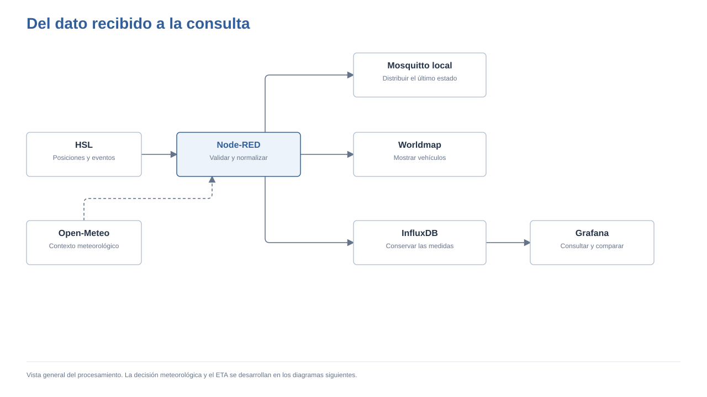

*Figura 1. Arquitectura de adquisición, distribución y consulta.*


La figura 2 muestra el flujo principal después de integrar las posiciones, los eventos de servicio y la entrada ETA del mapa.

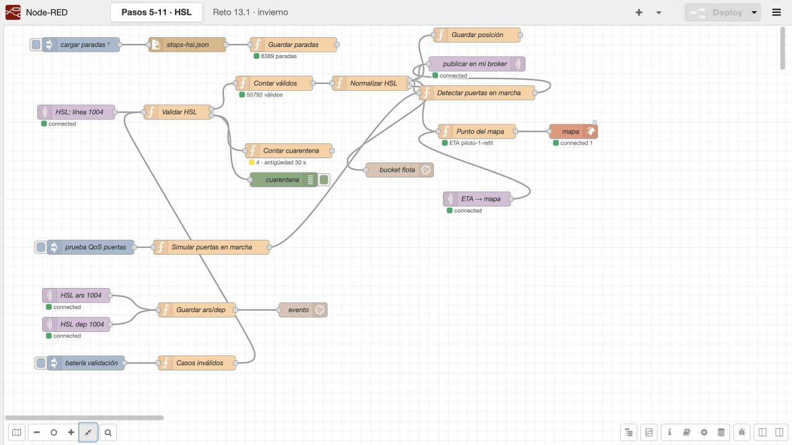

*Figura 2. Flujo principal de adquisición, validación y distribución. Captura del laboratorio.*

## Metodología de desarrollo

El trabajo se organizó de forma incremental. Primero se inspeccionaron mensajes en terminal y MQTTX; después se trasladó la suscripción a Node-RED. La normalización permitió reutilizar un mismo contrato en el mapa, el almacenamiento y las reglas. Las ampliaciones se construyeron cuando la cadena de posiciones ya funcionaba.

Cada etapa se comprobó a partir de sus resultados. Se utilizaron mensajes crudos para las suscripciones, contadores para la validación, consultas para la persistencia y paneles para las agregaciones. Las pruebas controladas se identificaron como sintéticas. Las pruebas posteriores de funciones se ejecutaron en memoria, sin publicar datos ni añadir registros a InfluxDB.

Las fechas se compararon en UTC. Algunas interfaces muestran la hora de Madrid; el 29 y el 30 de septiembre la diferencia era de dos horas. En las capturas se conserva el rango temporal de la interfaz, mientras que las tablas de evaluación indican expresamente UTC.

Durante el desarrollo se corrigieron problemas detectados al observar los resultados, como duplicados en el ranking de vehículos, conversión de valores nulos o vacíos a cero, medias horarias calculadas sobre grupos incorrectos y emparejamientos incompletos de predicciones y llegadas. Los apartados siguientes describen el funcionamiento resultante y, cuando afecta a una métrica, la versión que la produjo.

## Adquisición MQTT y selección de mensajes

### Estructura y filtros

HSL organiza los mensajes por tipo de evento, medio de transporte, vehículo, línea y sentido. Al principio se escucharon los tranvías para entender esa estructura; después se redujo la adquisición a la línea 4. Para estudiar un único sentido bastó con añadir esa condición al filtro, sin modificar el contenido de los mensajes.

Los comodines permiten seleccionar grupos completos del árbol. Uno ocupa un nivel y el otro admite los niveles restantes. Los filtros exactos y sus ejemplos están en el [contrato MQTT del repositorio](https://github.com/alanslzrr/hsl-digital-twin/blob/191f7923b739ae029eecfeedafa36d2fff82bacf/docs/contrato-mqtt.md). La memoria se centra aquí en qué se seleccionó y qué se observó.

La prueba del sentido 1 produjo 360 líneas y 90 mensajes distintos en 30 segundos, repartidos entre tres vehículos. La repetición de cada mensaje cuatro veces se observó en esa captura y se tuvo en cuenta al calcular la frecuencia por vehículo.

También se probaron los eventos `doo` y `doc`. En una ventana de 120 segundos, el vehículo `00635` abrió las puertas a las 18:08:05Z y las cerró 15 segundos después, con velocidad cero. Este caso permitió distinguir una publicación por evento de la actualización periódica de posición.

El filtrado geográfico se aplicó a una zona de Helsinki comprendida entre las latitudes 60,18 y 60,19 y las longitudes 24,95 y 24,97. La selección devolvió 1 034 mensajes; 282 pertenecían a la segunda de las dos ramas geográficas utilizadas. Para extraer el topic se tomó como separador el inicio del objeto JSON, porque los nombres de parada pueden contener espacios.

### Medición del caudal

Se midieron tres ventanas consecutivas de 60 segundos. El cliente MQTT recibió los payloads y se contaron los mensajes y los bytes de su salida, sin sumar el nombre del topic.

| Suscripción | Mensajes | Bytes de salida | Mensajes/s | kB/s | Extrapolación GB/día |
| --- | ---: | ---: | ---: | ---: | ---: |
| Todas las posiciones | 56 292 | 17 020 576 | 938,2 | 283,7 | 24,51 |
| Tranvías | 20 243 | 6 093 651 | 337,4 | 101,6 | 8,77 |
| Nivel geográfico 0 | 1 136 | 338 760 | 18,9 | 5,65 | 0,49 |

La extrapolación se calculó como `bytes / 60 × 86400 / 10⁹`. Describe lo que ocuparía mantener el caudal de la muestra durante un día. Los bytes incluyen el salto de línea añadido por el cliente; no representan una medición de las tramas de red. Las ventanas tampoco fueron simultáneas.

El payload de referencia ocupa 303 bytes y la selección compacta de siete campos ocupa 87 bytes. La aproximación didáctica `87 / (303 + 2 + 40)` produce un 25,2 % de datos seleccionados respecto al total simplificado. El topic del ejemplo ya añade 92 bytes, por lo que esa aproximación no debe interpretarse como eficiencia real del transporte.

## Contrato local y calidad de los datos

### Normalización

La función de normalización extrae el modo, el operador y el vehículo del topic, y transforma el contenido de `VP` en los dos mensajes siguientes.

| Topic | Contenido principal |
| --- | --- |
| Posición del vehículo | `lat`, `lon`, `spd`, `hdg`, `ts`, `src`; posteriormente distancia, parada y viaje |
| Estado del vehículo | Línea, sentido, `retraso_s`, puertas, parada, viaje, fecha y fuente |

La transformación cambia `long` por `lon` y expresa las puertas mediante un estado legible. Se mantiene el signo original del retraso. Los valores negativos representan retraso y los positivos adelanto.

Ambos mensajes se publican con QoS 0 y retención en el broker local. Sus nombres completos y campos están en el [contrato de mensajes](https://github.com/alanslzrr/hsl-digital-twin/blob/191f7923b739ae029eecfeedafa36d2fff82bacf/docs/contrato-mqtt.md). Esto permite que un suscriptor nuevo recupere el último estado publicado de cada vehículo. En MQTTX se comprobó la recepción de una posición retenida mientras la entrada externa estaba desactivada (figura 3).

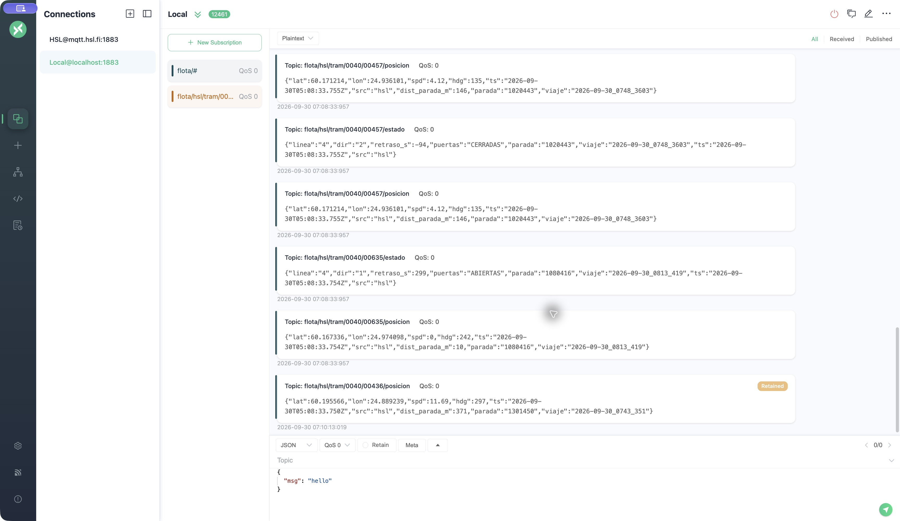

*Figura 3. Posición local con identificación Retained en MQTTX. Captura del laboratorio.*

La retención pertenece al broker; la caducidad visual del mapa es un mecanismo distinto. Un marcador puede desaparecer del mapa y seguir existiendo un mensaje retenido. En esta implementación la limpieza de retenidos se realizó durante el cierre, mediante mensajes vacíos con la marca de retención.

### Validación y cuarentena

La entrada MQTT se recibe como texto y se valida antes de la normalización. Se rechazan mensajes nulos, vacíos, no interpretables como JSON o que no contienen un objeto `VP` válido. También se comprueban las siguientes condiciones.

- Posición de origen `GPS`.
- Coordenadas numéricas y finitas dentro de `59.9–60.5` de latitud y `24.4–25.5` de longitud.
- Velocidad numérica entre 0 y 45 m/s.
- Fecha interpretable y diferencia absoluta con el reloj no superior a 30 segundos.

Los rechazos se dirigen a una salida separada con `msg.motivo` y contadores por causa. Una observación de 318 segundos sobre la línea 1004 produjo 10 156 mensajes válidos y cero rechazos. En otra muestra, de todos los tranvías, 20 de 10 564 posiciones tenían origen `DR`. Los diez casos inválidos preparados para probar el validador fueron rechazados.

Se propuso añadir una comprobación de continuidad del odómetro, comparando su incremento con la velocidad y el tiempo transcurrido, y contemplando cambios de viaje o reinicios. Esa regla no se incorporó al flujo entregado.

## Mapa, persistencia y paneles

### Representación de la flota

Worldmap utiliza las posiciones normalizadas para crear marcadores identificados como `operador-vehículo`. La velocidad se convierte de m/s a km/h para su presentación. El mapa se centra en Helsinki, en `60.17, 24.94`, con zoom 12; los marcadores tienen una duración de 120 segundos sin actualización.

La figura 4 muestra ocho vehículos y la ficha de uno de ellos. Más adelante se amplió esa ficha con la información del ETA.

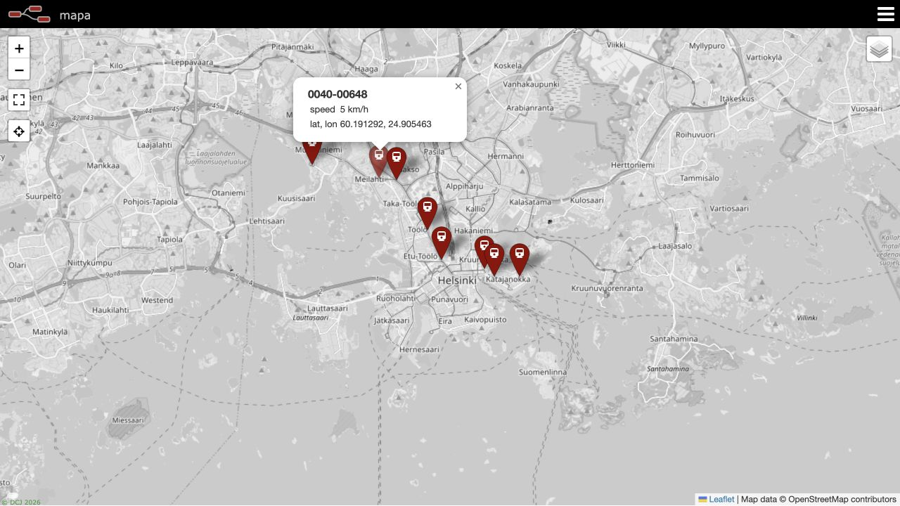

*Figura 4. Mapa de la flota con datos de un vehículo. Captura del laboratorio.*

### Modelo de almacenamiento

El almacenamiento se configuró con [InfluxDB 2](https://docs.influxdata.com/influxdb/v2/), utilizando la organización `lab`, el bucket `flota` y la medición `vehiculo`. Las magnitudes medidas, como `spd`, `retraso_s`, `puertas_abiertas`, `lat` y `lon`, se almacenan como fields. Modo, operador, vehículo, línea y sentido se utilizan como tags para identificar y agrupar series.

Los eventos de llegada y salida se distinguen mediante `evento`. Las consultas de retraso de posiciones incluyen `not exists r.evento` para excluirlos. Para el ETA se añadieron la distancia a la parada y los identificadores necesarios para reconstruir el viaje.

Una consulta de medias por minuto entre las 05:15 y las 05:20 UTC del 30 de septiembre devolvió 79,69; 55,24; 28,07; 18,74 y 18,09 segundos. El resultado se conserva tanto en la captura de InfluxDB como en el CSV de la parte 9.

### Dashboard de seguimiento

Los paneles base, construidos con las herramientas de [Grafana](https://grafana.com/docs/grafana/latest/), muestran la media de retraso de la línea 4, un ranking de cinco vehículos y el número de vehículos activos. La curva utiliza el rango seleccionado y medias de un minuto. El ranking consulta los últimos cinco minutos; el contador usa los últimos dos.

Para evitar que un vehículo aparezca una vez por cada sentido, el ranking agrupa por vehículo y línea antes de aplicar `last()`. Después reúne los resultados, ordena `retraso_s` de menor a mayor y limita a cinco filas. Si hay menos de cinco vehículos retrasados, la tabla incluye también valores de adelanto. La figura 5 reúne los tres paneles.

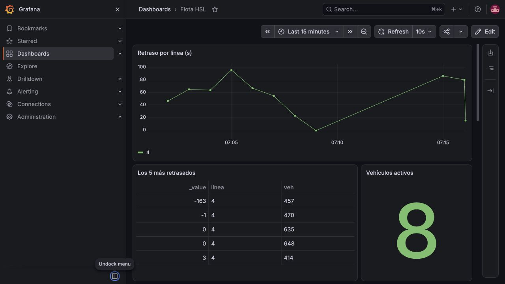

*Figura 5. Dashboard base con cinco vehículos distintos y ocho activos. Captura del laboratorio.*

## Alarmas y niveles de servicio

La alarma local detecta puertas abiertas con velocidad superior a 3 m/s. Node-RED conserva la última posición por vehículo y consulta esa velocidad al procesar el estado. Cuando se cumple la condición publica una alarma de puertas, con QoS 1 y sin retención. El receptor debe poder tratar duplicados; QoS 1 no garantiza una única entrega a la aplicación.

Durante diez minutos de observación no se registraron activaciones. Se utilizó el vehículo sintético `00999`, a 8 m/s y con puertas abiertas, para comprobar el intercambio `PUBLISH`–`PUBACK`. Cinco pruebas dieron latencias entre 2 y 3 milisegundos, medidas desde la fecha del mensaje hasta el suscriptor en el entorno de laboratorio.

En Grafana se configuró una condición sobre el último `retraso_s` de la línea 4 inferior a −300 s, con evaluación cada 10 segundos y espera pendiente de 10 segundos. El vehículo `00648`, sentido 2, registró −301 s a las 12:48:02.292Z y la alerta pasó a `Alerting` a las 12:48:20Z. La diferencia fue de aproximadamente 17,7 segundos.

Estas medidas ilustran dos mecanismos con condiciones y temporizaciones distintas; no son un ensayo comparativo del mismo evento. La alarma local tampoco incorpora todavía una persistencia de varias lecturas para filtrar transitorios entre velocidad y puertas.

## Reto R1 · Decisión del plan de invierno

### Contexto meteorológico

La [API de Open-Meteo](https://open-meteo.com/en/docs) se consulta cada diez minutos. La respuesta se transforma en contexto actual y previsión, publicados como mensajes retenidos de contexto actual y previsión, además de almacenarse en el histórico meteorológico.

La nieve de la hora actual se expresa como `nieve_cm_h`. La variable `nieve_2h_cm` suma las dos primeras horas de la previsión solicitada y representa centímetros acumulados en ese intervalo. Se conserva la fecha de la fuente, en lugar de reemplazarla por la hora de recepción.

Se rechaza un contexto con fecha ilegible, antigüedad superior a dos horas o más de cinco minutos en el futuro. Los campos nulos se comprueban antes de convertirlos a número, porque `Number(null)` produciría cero. Una respuesta inválida no sustituye al contexto anterior; al decidir se vuelve a comprobar la vigencia del contexto disponible.

### Ventanas y regla

Cada cinco minutos se calculan dos medias de retraso.

- `ahora` corresponde a los últimos diez minutos.
- `antes` corresponde al intervalo comprendido entre hace 70 y 60 minutos.

Se define `empeoramiento = media_antes - media_ahora`. Debido al signo de HSL, un resultado positivo indica que el valor se ha desplazado hacia un mayor retraso. La activación requiere simultáneamente nieve actual o prevista mayor que cero y empeoramiento estrictamente superior a 90 segundos.

La salida incluye `activar`, `valida`, el motivo, las medias empleadas y las fechas. Si falta contexto vigente o cualquiera de las ventanas, se publica `activar: false` y `valida: false`. Así se distingue una decisión negativa con información suficiente de una decisión que no puede calcularse.

El lector del CSV de Influx ignora las medias vacías o no numéricas. El valor numérico cero se conserva como válido. Esta distinción impide que un intervalo sin observaciones se interprete como puntualidad perfecta. El flujo de adquisición y decisión se muestra en la figura 7.

La figura 6 separa las dos preguntas de la regla. Primero, si se dispone de información suficiente; después, si coinciden nieve y empeoramiento. Así se entiende por qué «no activar» puede tener dos significados diferentes.

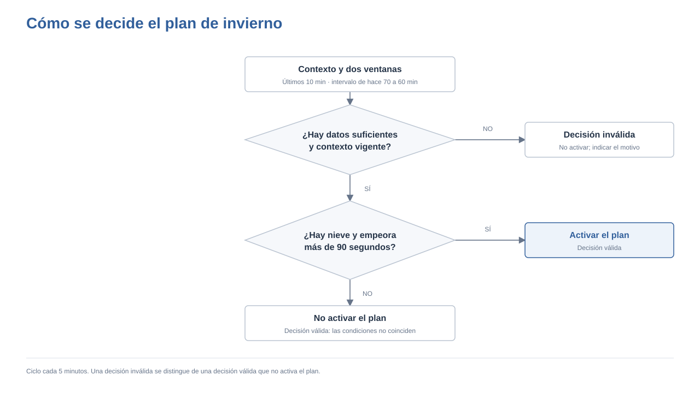

*Figura 6. Decisión del plan de invierno según la disponibilidad de datos y condiciones de activación.*

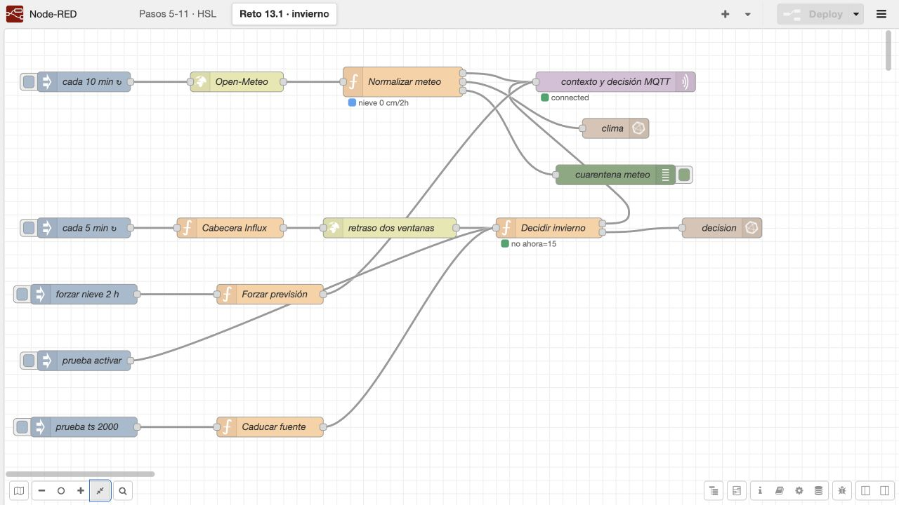

*Figura 7. Flujo de adquisición meteorológica y decisión por ventanas. Captura del laboratorio.*

La decisión se publica en un topic propio con QoS 2 y retención, y se escribe en InfluxDB. En el broker se registró la secuencia `PUBREC`, `PUBREL` y `PUBCOMP`. La retención permite consultar la última decisión; su validez sigue dependiendo de las comprobaciones de la aplicación.

### Comprobación con datos y pruebas controladas

Los siguientes registros pertenecen al 29 de septiembre, en UTC. En los tres casos la nieve prevista era cero.

| Hora | Media ahora | Media antes | Empeoramiento | Resultado |
| --- | ---: | ---: | ---: | --- |
| 12:59:41 | −52,73 s | +41,72 s | +94,44 s | Válida, no activar por falta de nieve |
| 13:06:16 | −8,17 s | +51,15 s | +59,32 s | Válida, no activar |
| 13:15:34 | +15,22 s | +14,84 s | −0,38 s | Válida, no activar |

Las diferencias se obtienen con los valores originales antes del redondeo. Para probar una activación se introdujeron 1,2 cm de nieve prevista y un empeoramiento de 140 s en un topic de pruebas separado, sin retención ni escritura en InfluxDB. La prueba de caducidad utilizó una fecha del año 2000, publicó una decisión marcada como sintética y fue seguida de la restauración del contexto real.

En la figura 8, del 30 de septiembre, a las 07:24:41 de Madrid, la decisión es válida y no activa el plan. Las medias son aproximadamente +24,39 s y −14,78 s, con nieve prevista cero.

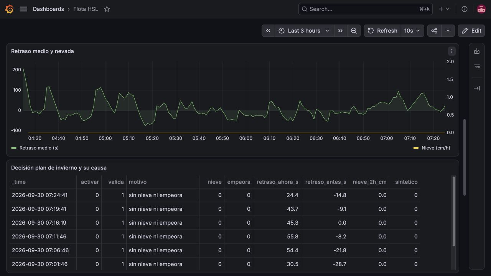

*Figura 8. Retraso, nieve y motivos de las decisiones en Grafana. Captura del laboratorio.*

Estos casos permiten comprobar la ejecución de la regla. Para estudiar su utilidad operativa sería necesario relacionar los retrasos con incidencias meteorológicas, recursos disponibles, costes y resultados de actuaciones. Una reconstrucción histórica debe utilizar únicamente el contexto disponible en cada instante.

## Reto S-A · Predicción de llegada

### Definición del problema y variables

El objetivo del modelo es estimar los segundos que faltan hasta una llegada `ars` a una parada determinada. Se incorporaron las coordenadas de 8 389 paradas y se calculó la distancia geográfica mediante Haversine. Esa distancia es directa entre coordenadas, no la longitud del recorrido por las vías.

| Variable | Interpretación |
| --- | --- |
| `retraso_s` | Desviación del vehículo respecto al horario |
| `spd` | Velocidad en m/s |
| `hora` | Hora decimal obtenida de la fecha UTC |
| `dia_semana` | Día de la semana |
| `dist_parada_m` | Distancia geográfica a la parada objetivo |
| `retraso_medio_linea` | Media temporal de retraso de la línea |
| `nieve_cm_h` | Nieve del contexto meteorológico |

La línea base es `ETA_base = dist_parada_m / max(spd, 1)`. El mínimo de 1 m/s evita dividir por cero, aunque produce estimaciones elevadas cuando el vehículo está parado y todavía lejos de la parada.

### Preparación y corte temporal

Las posiciones se ordenan y se conserva una por vehículo y segundo. El emparejamiento corregido exige coincidencia de vehículo, parada y viaje; el viaje incluye día operativo, hora de salida y `jrn`. La etiqueta es la diferencia positiva entre la fecha de llegada y la fecha de la posición.

La meteorología se asocia hacia atrás en el tiempo. La media de retraso de la línea se calcula con una ventana de 600 segundos y un desplazamiento previo de una observación. La separación entrenamiento/prueba usa un corte temporal 80/20. Una fila anterior al corte solo entra en entrenamiento si su llegada también había ocurrido antes o en ese instante.

El regresor configurado es [`LGBMRegressor`, de LightGBM](https://lightgbm.readthedocs.io/en/stable/Python-API.html), con 400 estimadores, tasa de aprendizaje 0,05 y 31 hojas. Se calcula el error absoluto medio, en segundos.

```text
MAE = suma(|ETA_predicho − tiempo_real_restante|) / número_de_predicciones
```

### Evolución del entrenamiento

El piloto original utilizó posiciones de las 12:52:11 a las 13:06:31 UTC del 29 de septiembre. Se recopilaron 8 205 posiciones a 1 Hz, 70 llegadas y 6 250 filas preparadas de ocho vehículos. El conjunto se dividió en 5 000 filas de entrenamiento y 1 250 de prueba.

| Grupo del piloto original | MAE base | MAE modelo |
| --- | ---: | ---: |
| Global | 33,82 s | 15,96 s |
| Parado | 76,50 s | 19,86 s |
| En marcha | 13,89 s | 14,15 s |

Ese primer emparejamiento buscaba la siguiente llegada del vehículo sin comprobar parada y viaje. También podía admitir etiquetas cuya llegada ocurriera después del corte. Se corrigieron ambos aspectos en la preparación posterior.

El ensayo con los identificadores completos reunió 884 filas. Se excluyeron 214 del entrenamiento por tener una llegada posterior al corte; quedaron 493 de entrenamiento y 177 de prueba. Los MAE fueron 10,75 s para la base y 5,59 s para el modelo. La ventana emparejada era de 0,06 h y no contenía casos de más de 60 segundos, por lo que este ajuste no sustituyó al modelo del servicio.

El archivo guardado `piloto-1-refit` procede de un reajuste del piloto original, con MAE de 16,41 s frente a 33,82 s de la base en aquel corte. La comparación en vivo del día 29 mantuvo en memoria los pesos anteriores, identificados como `piloto-1`. La corrección del evaluador y un reentrenamiento del modelo son cambios distintos.


La importancia de variables registrada por LightGBM se recoge en la tabla siguiente.

| Variable | Piloto original | Ajuste con parada y viaje |
| --- | ---: | ---: |
| `retraso_s` | 3 683 | 926 |
| `retraso_medio_linea` | 3 465 | 1 812 |
| `dist_parada_m` | 2 419 | 2 693 |
| `spd` | 1 778 | 1 810 |
| `hora` | 655 | 114 |
| `dia_semana` | 0 | 0 |
| `nieve_cm_h` | 0 | 0 |

Son valores de `feature_importances_`, no porcentajes ni efectos causales. El día y la nieve no variaban en la muestra, por lo que sus valores cero no permiten valorar su utilidad en otras condiciones.

### Evaluación en vivo

El primer evaluador puntuaba solo la última predicción anterior a la llegada. Produjo 157 errores con un horizonte restante medio de 1,63 s y MAE de 39,88 s para el modelo y 2,27 s para la base. Ese procedimiento concentraba la comparación en el instante inmediatamente anterior a llegar.

El [evaluador implementado en Python](https://github.com/alanslzrr/hsl-digital-twin/blob/191f7923b739ae029eecfeedafa36d2fff82bacf/src/eta_ml.py#L235-L457), identificado como `v2`, conserva todas las predicciones pendientes con su vehículo, viaje, parada, fecha de emisión y versión. Al recibir el `ars` correspondiente calcula el error de cada predicción y lo escribe en `error_eta`. Se registra el horizonte real y se separan los casos con velocidad inferior a 1 m/s de los casos en marcha. El horizonte real se conoce al llegar y sirve para evaluar, no como entrada disponible al predecir.

La figura 9 muestra el cambio de evaluación. Cada posición puede generar una predicción; la llegada permite calcular después el error de todas las que correspondían a esa parada y ese viaje.

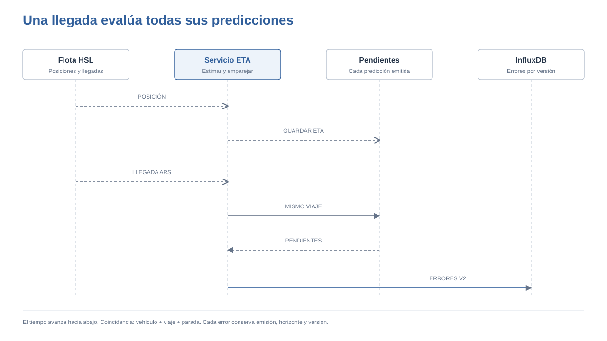

*Figura 9. Secuencia de almacenamiento y evaluación de las predicciones pendientes.*

El [resumen de resultados de `piloto-1`](https://github.com/alanslzrr/hsl-digital-twin/blob/191f7923b739ae029eecfeedafa36d2fff82bacf/results/eta-vivo-2h.json) abarca desde las 13:51:58.166 hasta las 15:54:04.165 UTC del 29 de septiembre. Contiene 20 786 predicciones, con los resultados de la tabla siguiente.

| Horizonte real | Estado | n | MAE base | MAE modelo |
| --- | --- | ---: | ---: | ---: |
| < 30 s | En marcha | 9 777 | 3,98 s | 11,62 s |
| < 30 s | Parado | 271 | 58,11 s | 26,86 s |
| 30–60 s | En marcha | 5 391 | 14,38 s | 11,58 s |
| 30–60 s | Parado | 839 | 107,27 s | 9,83 s |
| > 60 s | En marcha | 3 453 | 39,81 s | 29,54 s |
| > 60 s | Parado | 1 055 | 238,09 s | 34,88 s |
| Global | Todos | 20 786 | 29,39 s | 15,89 s |

La reducción del error global se concentra especialmente en las situaciones de parada, donde la fórmula de la base penaliza la distancia con una velocidad mínima fija. En el grupo más numeroso, en marcha y a menos de 30 segundos, la base obtiene menor error. El resultado apoya estudiar una selección entre métodos según el contexto, pero no establece una sustitución general de la base.

### Agregación en Grafana

El panel utiliza la ventana fija del 29 de septiembre, de 13:51 a 15:55 UTC, y filtra `metodo=v2` y `version=piloto-1`. Para obtener las dos series horarias globales se agrupa por `_field` antes de `aggregateWindow`; de otro modo, vehículo, viaje y parada conservan grupos que no representan la media global buscada.

Los puntos etiquetados a las 14:00 UTC tienen MAE de 29,52 s para la base y 15,52 s para el modelo. A las 15:00 UTC son 29,71 s y 15,93 s. El punto final de las 15:55 corresponde a una ventana parcial. Los valores globales se calculan sobre las predicciones, no como media simple de esos puntos horarios. La figura 10 muestra las dos series y la tabla por grupos.

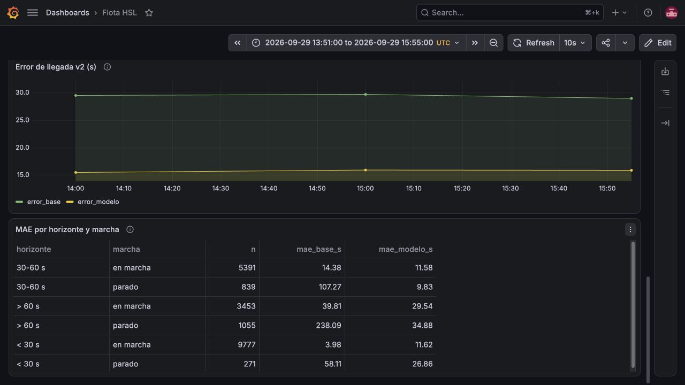

*Figura 10. Resultados de la comparación ETA y seis grupos de evaluación. Captura del laboratorio.*

### Servicio y presentación del ETA

El servicio Python consume posición, estado y meteorología por MQTT. Si un campo llega a `null`, elimina su valor anterior. No predice cuando posición y estado difieren más de 5 segundos o cuando alguno supera 15 segundos de antigüedad. También comprueba la vigencia meteorológica en cada predicción y restaura las suscripciones al reconectar con el broker.

La demostración iniciada el 30 de septiembre a las 05:35:28Z utiliza `piloto-1-refit`, sin reentrenar el archivo guardado. Publica el ETA y la base para que Node-RED los añada a la ficha del vehículo en el mapa.

El popup exige coincidencia de viaje y parada, ETA no mayor de 15 segundos, posición no mayor de 30 segundos y desfase entre ambos no superior a 5 segundos. Rechaza valores negativos o no finitos. Si las condiciones no se cumplen muestra «sin predicción vigente». La figura 11 muestra la ficha con ambas estimaciones.

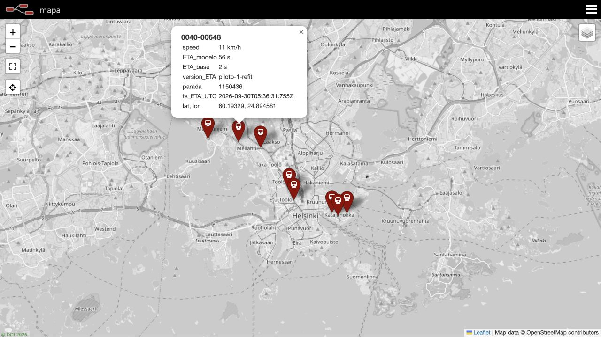

*Figura 11. Popup con las dos estimaciones, parada, versión y fecha. Captura del laboratorio.*

Esta nueva sesión tiene otra fecha y versión. Los filtros del panel histórico impiden sumarla a los 20 786 casos de la comparación cerrada.

## Pruebas y discusión de resultados

La comprobación funcional combina observación del circuito completo y pruebas aisladas. Las 23 pruebas de funciones cubren entradas HSL inválidas y válidas, ventanas de retraso ausentes o vacías, cero numérico, umbral estricto de 90 segundos, nieve, caducidad y campos meteorológicos nulos. Las cinco pruebas del mapa ETA cubren posición sin predicción, predicción válida, otro viaje, dato caducado y ETA negativo. Estas baterías se ejecutaron en memoria. El repositorio añade una [batería ejecutable de 30 casos](https://github.com/alanslzrr/hsl-digital-twin/blob/191f7923b739ae029eecfeedafa36d2fff82bacf/tests/funciones.test.cjs), separada de esos registros históricos, para volver a comprobar las funciones sin conectar al laboratorio.

Los intercambios QoS se comprobaron por separado en el broker. Las consultas de Influx y las capturas del mapa y Grafana muestran la integración entre componentes. Una captura describe el instante y el rango que aparecen en ella; para el análisis numérico se conservaron también las salidas TXT, CSV y JSON.

La flota observada permite comprobar el procesamiento continuo y la coherencia de las reglas. La evaluación del modelo contiene muchas predicciones consecutivas de los mismos viajes, por lo que 20 786 filas no equivalen a 20 786 situaciones independientes. El piloto tampoco permite analizar el efecto de la nieve, que permaneció constante. Por estas razones se presentan los grupos de evaluación junto con la media global.

Las siguientes mejoras se desprenden de los problemas observados. Se propone caducar automáticamente los retenidos de vehículos inactivos, exigir persistencia en la alarma de puertas, usar distancia por recorrido en el ETA y evaluar los errores también por viaje. Una eventual combinación de modelo y base tendría que decidirse con variables disponibles al emitir la predicción, no con el horizonte real conocido después.

## Cierre, seguridad y recuperación

El cierre completo del 30 de septiembre desactivó las entradas HSL de posición, `ars` y `dep`, mantuvo desconectada la conexión externa de MQTTX y guardó los 22 retenidos de `flota/hsl/…` antes de borrarlos. La consulta posterior no devolvió mensajes retenidos de la flota. Los cuatro contenedores se detuvieron a las 07:14:39–40 de Madrid y se arrancaron de nuevo para preparar la demostración.

Los volúmenes no se eliminaron. La comparación histórica conservó sus 20 786 casos después del cierre y el arranque. Los mensajes nuevos volvieron a poblar las posiciones sin reproducir las antiguas como datos actuales.

La conexión de laboratorio por el puerto 1883 no cifra los mensajes. Las comprobaciones de JSON y rangos detectan errores de formato o plausibilidad, pero no autentican a quien publica. Para un despliegue fuera del laboratorio habría que aplicar TLS, autenticación, permisos por topic y gestión de credenciales. También convendría fijar versiones de las imágenes que actualmente usan la etiqueta `latest` y versionar el contrato local.

El arranque y el cierre se explican paso a paso en la [guía de puesta en marcha](https://github.com/alanslzrr/hsl-digital-twin/blob/191f7923b739ae029eecfeedafa36d2fff82bacf/docs/puesta-en-marcha.md). La configuración publicada usa variables de entorno para las credenciales y limita los puertos al ordenador local. La exportación del flujo se importa en Node-RED y el token se configura allí de forma privada.

El servicio ETA se ejecuta aparte de Docker. Su modo de servicio carga unos pesos existentes; entrenar y servir son operaciones distintas. Para una nueva sesión deben conservarse por separado la versión del modelo y el intervalo de evaluación.

## Conclusiones

La práctica permitió construir el recorrido completo desde una publicación externa hasta su consulta en un mapa y una base temporal. La normalización hizo posible reutilizar los mismos datos en varias salidas, mientras que la validación y las comprobaciones de antigüedad evitaron interpretar mensajes incompletos o desfasados como estados actuales.

En el plan de invierno, la parte más importante fue distinguir entre ausencia de nieve, falta de datos y contexto caducado. La salida `valida` hace explícita esa diferencia y evita que una decisión retenida conserve indefinidamente un significado que ya no corresponde.

En el ETA, el emparejamiento por viaje y parada y la conservación de todas las predicciones cambiaron lo que se estaba midiendo. El modelo obtuvo menor MAE global en la ventana evaluada, pero la base fue mejor cerca de la llegada con el vehículo en marcha. La presentación conjunta de ambos resultados permite explicar esa diferencia y orientar los siguientes cambios del sistema.

## Repositorio del proyecto

[Flota HSL · Seguimiento y predicción de llegada](https://github.com/alanslzrr/hsl-digital-twin) reúne el código, los flujos, la configuración del entorno y los resultados de este sistema. Está organizado para poder seguir la explicación de la memoria y consultar el detalle técnico cuando sea necesario.

| Parte del sistema | Dónde consultarla |
| --- | --- |
| Servicios y configuración | [Docker Compose](https://github.com/alanslzrr/hsl-digital-twin/blob/191f7923b739ae029eecfeedafa36d2fff82bacf/compose.yaml) |
| Validación, normalización y reglas | [Flujo de Node-RED](https://github.com/alanslzrr/hsl-digital-twin/blob/191f7923b739ae029eecfeedafa36d2fff82bacf/flows/hsl.json) |
| Topics, unidades y filtros completos | [Contrato MQTT](https://github.com/alanslzrr/hsl-digital-twin/blob/191f7923b739ae029eecfeedafa36d2fff82bacf/docs/contrato-mqtt.md) |
| Entrenamiento, inferencia y evaluación | [Servicio ETA](https://github.com/alanslzrr/hsl-digital-twin/blob/191f7923b739ae029eecfeedafa36d2fff82bacf/src/eta_ml.py) |
| Ventana de comparación y métricas | [Resultados por grupo](https://github.com/alanslzrr/hsl-digital-twin/blob/191f7923b739ae029eecfeedafa36d2fff82bacf/results/eta-vivo-2h.json) |
| Regresiones ejecutables | [Pruebas de funciones](https://github.com/alanslzrr/hsl-digital-twin/blob/191f7923b739ae029eecfeedafa36d2fff82bacf/tests/funciones.test.cjs) |
| Esquemas de la memoria | [Diagramas editables](https://github.com/alanslzrr/hsl-digital-twin/tree/d6c48eae33228305245d80e7053f445722844890/docs/diagrams/) |

Se incluyen métricas agregadas y capturas seleccionadas. Los históricos individuales, los pesos binarios, los logs y las credenciales permanecen fuera de Git. El [manifiesto de artefactos](https://github.com/alanslzrr/hsl-digital-twin/blob/191f7923b739ae029eecfeedafa36d2fff82bacf/results/artifact-manifest.json) registra el tamaño y la huella de los archivos principales conservados localmente.

## Documentación y recursos

Los siguientes enlaces llevan a la documentación oficial de los componentes utilizados. Complementan las decisiones de implementación descritas en la memoria; los resultados numéricos proceden de los registros del laboratorio. Consultados el 30 de septiembre de 2026.

1. **Digitransit / HSL. High-frequency positioning.** Estructura de topics y mensajes de posición y eventos del transporte. [Consultar documentación](https://digitransit.fi/en/developers/apis/5-realtime-api/vehicle-positions/high-frequency-positioning/).
2. **Node-RED. User Guide.** Editor, mensajes, funciones, contexto y gestión de nodos. [Consultar documentación](https://nodered.org/docs/user-guide/).
3. **Eclipse Mosquitto. Documentation.** Broker, clientes de publicación y suscripción y configuración MQTT. [Consultar documentación](https://mosquitto.org/documentation/).
4. **InfluxData. InfluxDB OSS v2.** Almacenamiento temporal, buckets y consultas. [Consultar documentación](https://docs.influxdata.com/influxdb/v2/).
5. **Grafana Labs. Grafana documentation.** Fuentes de datos, paneles, transformaciones y alertas. [Consultar documentación](https://grafana.com/docs/grafana/latest/).
6. **Open-Meteo. Weather Forecast API.** Variables meteorológicas, unidades y parámetros de la previsión. [Consultar documentación](https://open-meteo.com/en/docs).
7. **LightGBM. Python API.** Interfaz del regresor y parámetros del modelo. [Consultar documentación](https://lightgbm.readthedocs.io/en/stable/Python-API.html).
8. **Docker. Compose documentation.** Servicios, red y persistencia del entorno. [Consultar documentación](https://docs.docker.com/compose/).

Las capturas incluidas proceden del laboratorio. Los diagramas resumen su funcionamiento y sus versiones editables se conservan en el repositorio.
