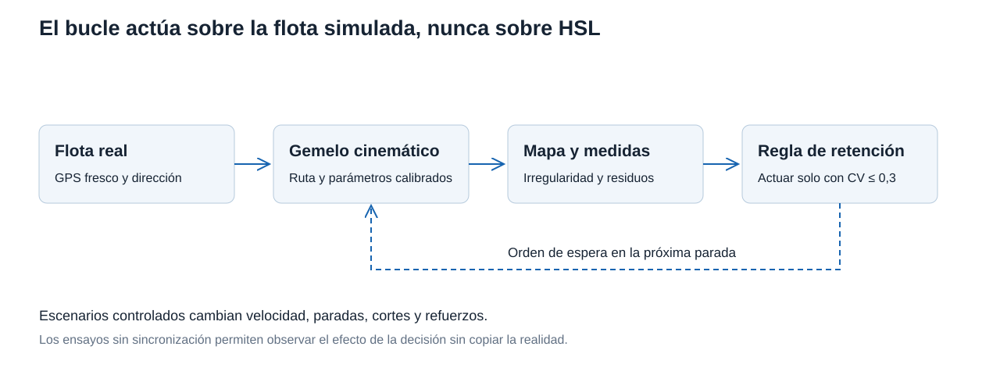
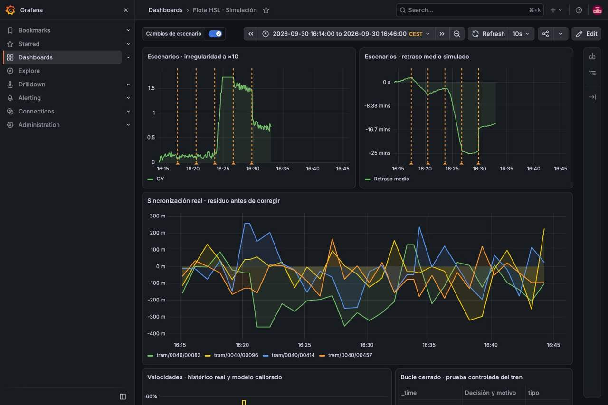
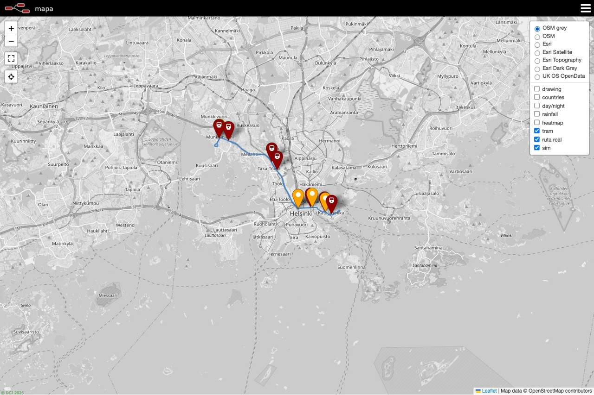
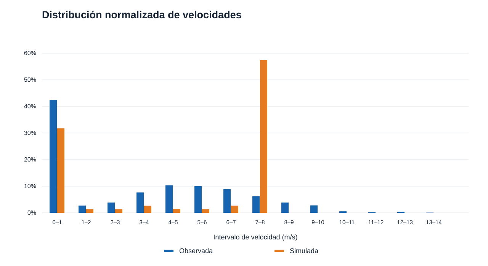
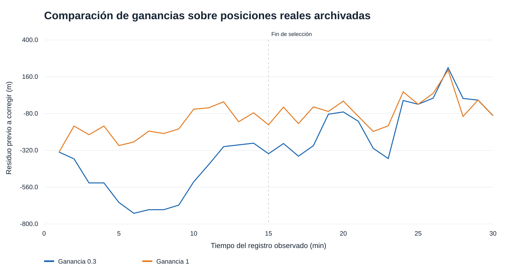
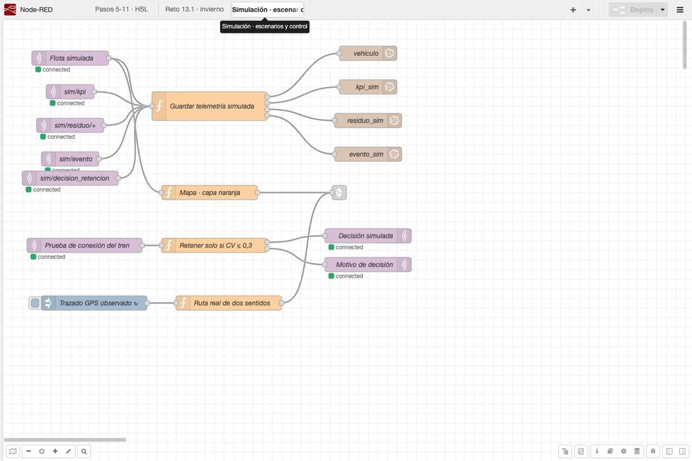
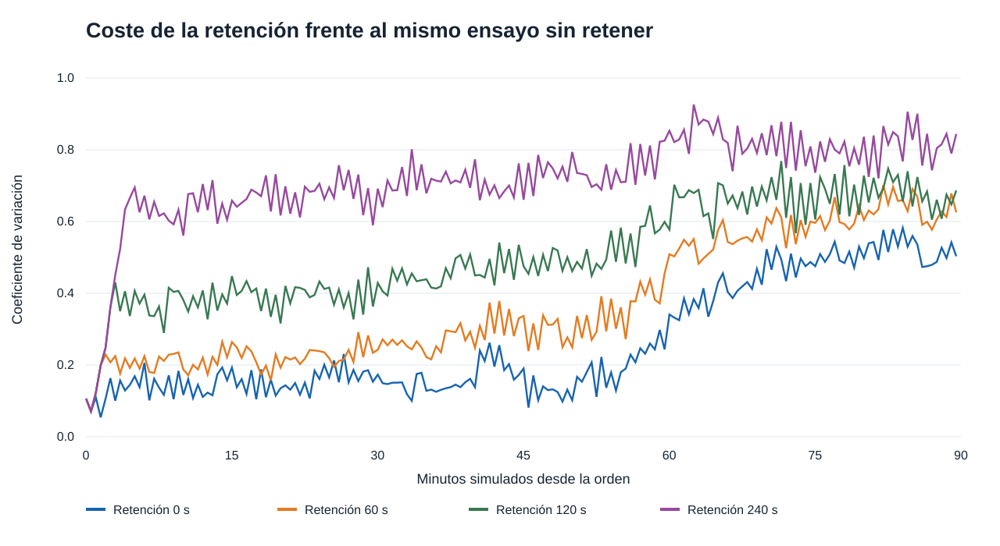

# Simulación de la flota HSL

### Modelo y separación de fuentes

El seguimiento muestra lo que ocurre en HSL. La simulación añade un entorno donde podemos cambiar las condiciones y ejecutar una decisión sin intervenir sobre el transporte real. El [simulador cinemático](https://github.com/alanslzrr/hsl-digital-twin/blob/main/src/sim_flota.py) avanza en pasos de un segundo sobre una polilínea. Cada vehículo acelera y frena, se detiene en paradas y mantiene una separación mínima de doce metros, sin adelantamientos. Las esperas tienen dispersión lognormal y pueden incorporar un término proporcional al intervalo desde el tranvía anterior.

Los topics `sim/` y el tag `src=sim` distinguen estas posiciones de las observaciones. Las consultas de retraso real, la regla de invierno y el ETA excluyen las posiciones simuladas. Cada ensayo conserva un `run_id`; los comandos de un ensayo no afectan a otro. La actuación solo llega a operadores simulados `99xx`.



### S1 · Dos capas y un indicador de regularidad

Aquí incorporamos la flota simulada al mapa que ya muestra los tranvías reales. Los marcadores naranjas recorren la ruta y los reales siguen recibiendo HSL. El KPI se publica cada treinta segundos simulados y conserva tanto la fecha real de emisión como el tiempo virtual.


Un mensaje recibido de `sim/kpi` muestra el estado de la sesión de demostración.

```json
{
  "run_id": "demo-simulacion-20260930",
  "ts": "2026-09-30T15:19:00.242Z",
  "vehiculos": 4,
  "irregularidad": 0.40907860522323186,
  "t_sim_s": 1381.0,
  "factor_tiempo": 1
}
```

La irregularidad es el coeficiente de variación del espaciado sobre la ruta, calculado como desviación típica dividida entre la separación media. Cero corresponde a un reparto uniforme. No es una probabilidad ni está limitado a uno. Con cuatro vehículos puede llegar a la raíz de tres cuando se concentran en un mismo punto. Este indicador describe los huecos que encuentra el pasajero; una media de retraso pequeña puede ocultar varios tranvías juntos y una espera larga detrás del grupo. El headway mostrado es una conversión cinemática del espaciado, no un horario comercial medido en cada parada.

### S2 · Escenarios controlados

El ensayo MQTT utiliza la ruta sintética, una semilla fija y factor temporal diez. Cada fase dura treinta minutos simulados, aproximadamente tres minutos de reloj, aunque el procesamiento introduce un pequeño desfase. Los comandos quedan registrados y aparecen como anotaciones de Grafana. Después de cada perturbación se restaura el nominal para observar su evolución antes de introducir la siguiente.

| Fase | CV al final de la fase | Retraso medio, s | Vehículos |
| --- | --- | --- | --- |
| Nominal | 0.106 | 106.2 | 4 |
| Nieve | 0.130 | -257.7 | 4 |
| Nominal tras nieve | 0.161 | -140.9 | 4 |
| Corte | 1.718 | -1439.6 | 4 |
| Nominal tras corte | 1.436 | -1459.7 | 4 |
| Refuerzo +2 | 0.770 | -876.9 | 6 |

El signo del retraso sigue HSL, negativo significa llegar tarde. Los valores de esta tabla se comparan con el horario nominal interno del simulador, no con el horario comercial ni con el retraso publicado por HSL. El tiempo nominal combina marcha y paradas y aplica un factor 1,3 al tiempo de recorrido a velocidad de crucero; ese coeficiente pertenece al modelo y no se estimó con los datos GPS. La nieve añade ocho segundos por parada y reduce la velocidad al setenta por ciento. Su retirada mejora parte del retraso, pero no devuelve automáticamente la regularidad inicial. El corte concentra la flota y la recuperación nominal no deshace el agrupamiento durante los treinta minutos simulados observados. Es persistencia dentro de este horizonte, no una demostración de irreversibilidad para cualquier duración. El refuerzo de dos vehículos reduce el CV al final de la fase, aunque continúa lejos del nominal.



Para aislar el mecanismo de pasajeros se ejecutaron cuatro ensayos de cuarenta minutos virtuales con la misma semilla. Sin el término de demanda, el CV final fue 0,113 en nominal y 0,102 con nieve. Con `beta=0,12` alcanzó 1,193 y 0,754, respectivamente. El umbral CV 0,6 apareció a los 1 435 segundos en nominal y a los 2 143 con nieve. En esta configuración la nieve no adelantó el agrupamiento. El término de demanda amplifica perturbaciones, pero el efecto conjunto depende de la velocidad, las esperas y las condiciones iniciales.

Para acercar el modelo a una operación real faltan demanda por parada y hora, capacidad y ocupación, cruces semafóricos, prioridades, regulación del conductor y horarios comerciales. Las paradas equiespaciadas y la velocidad de crucero única simplifican demasiado estos mecanismos. Una única semilla permite repetir el ensayo, no cuantificar su variabilidad entre días o escenarios.

### S3 · Reconstrucción y calibración

La geometría procede de dos viajes completos consecutivos del vehículo `0040/00435`, uno por sentido, observados el 29 de septiembre entre las 15.03.29 y las 16.26.01 UTC. Se conservaron posiciones GPS en orden temporal y se redujeron los puntos próximos a menos de veinticinco metros. Los enlaces entre terminales miden 18,3 y 4,3 metros, evitando cerrar un recorrido parcial mediante una diagonal ficticia. La polilínea reconstruida tiene 15 933 metros y mantiene los rangos de ambos sentidos para la proyección.



| Parámetro | Valor | Procedimiento |
| --- | --- | --- |
| Velocidad de crucero | 7,8665 m/s | Percentil 85 de 2 830 muestras en marcha, tras agrupar a un segundo |
| Escala de espera en parada | 22,3 s | Media de 40 episodios completos con puertas abiertas, sin huecos largos |
| Separación de paradas | 370,54 m | Longitud del ciclo dividida por 43 llegadas de los dos viajes |

La escala de 22,3 segundos se pasa al generador lognormal; con dispersión 0,35 su esperanza es aproximadamente 23,7 segundos, no exactamente 22,3. La distribución real contiene 4 912 segundos observados y la simulada 19 648 muestras de cuatro vehículos. El histograma normaliza cada conjunto por separado para evitar comparar conteos de tamaños distintos.



Ambas distribuciones incluyen detenciones y marcha. La simulación concentra la marcha cerca de la velocidad de crucero y no reproduce la dispersión real ni sus velocidades superiores. La calibración aproxima tres parámetros, pero no identifica todos los movimientos. No se interpreta la diferencia del histograma como una validación completa del modelo.

### S4 · Asimilación y elección de ganancia

Cada minuto se proyecta una posición real reciente sobre el sentido correspondiente y se calcula el residuo firmado entre observación y predicción. La corrección añade al estado la ganancia multiplicada por ese residuo. Una ganancia uno copia la posición en el instante de corrección; el residuo que se evalúa es el anterior, después de haber evolucionado durante el minuto. El residuo posterior sería cero por construcción y no serviría para valorar la predicción.

La selección de ganancia compara 0,1, 0,3, 0,5, 0,7 y 1 sobre un registro real archivado. Los primeros quince minutos seleccionan por RMSE y los quince siguientes se reservan para evaluación. Se eligió uno; en la parte reservada el RMSE fue 106,02 metros frente a 201,21 con ganancia 0,3, y el MAE 85,14 frente a 151,28 metros. Esta comparación es una reproducción cronológica del registro, distinta de la observación en vivo posterior.



En vivo se observaron cuatro parejas estables durante 1 805,7 segundos desde la alineación inicial hasta la última corrección. Cada pareja aportó treinta residuos predictivos; estos abarcan 1 745,5 segundos, porque la primera alineación se excluye de las métricas. El panel conserva la ventana cerrada de las 14.14 a las 14.46 UTC. No hay aceleración temporal en este ensayo.

| Simulado | Vehículo real | Media, m | MAE, m | RMSE, m |
| --- | --- | --- | --- | --- |
| 00001 | tram/0040/00083 | -139.32 | 157.53 | 193.96 |
| 00002 | tram/0040/00096 | -31.94 | 90.80 | 125.53 |
| 00003 | tram/0040/00414 | -17.77 | 99.67 | 130.32 |
| 00004 | tram/0040/00457 | -57.92 | 83.52 | 102.58 |

El vehículo 00083 presenta el sesgo negativo más marcado y el mayor error. La realidad avanza más despacio que la predicción de este modelo durante buena parte de la ventana. Los vehículos 00096 y 00414 alternan signos y tienen menores sesgos medios; no basta una media próxima a cero para descartar desviaciones puntuales. El 00457 obtiene el menor RMSE de estas cuatro parejas, aunque mantiene un sesgo negativo. Estas diferencias no identifican por sí solas nieve ni una incidencia causal.

Para asimilar se exigen posición y estado de menos de quince segundos, diferencia entre sus fechas no superior a cinco segundos y distancia a la ruta menor de ciento cincuenta metros. Un nulo borra el valor anterior. El emparejamiento se mantiene durante el ensayo y los campos conservan la fecha de la observación utilizada.

### S5 · La decisión actúa sobre el gemelo

La [regla de retención](https://github.com/alanslzrr/hsl-digital-twin/blob/main/flows/simulacion/retener.js) recibe un disparo de tren explícitamente sintético. Se probó un retraso de trescientos segundos, superior al umbral estricto de cuatro minutos. Antes de autorizar revisa el KPI del mismo ensayo, su antigüedad y que el CV no supere 0,3. La orden reserva una espera adicional para la próxima parada del vehículo simulado. No comunica órdenes a HSL ni garantiza una conexión real.



La prueba MQTT autorizó sesenta segundos con CV prácticamente cero y el simulador registró la aplicación. Tras un corte, rechazó una solicitud de doscientos cuarenta segundos con CV 0,403. Se guardaron autorización, aplicación y bloqueo en InfluxDB. Los identificadores de solicitud evitan repetir una orden y las peticiones sin KPI vigente o dirigidas a un operador real se rechazan.

Para medir el efecto de la espera se ejecutaron ensayos pareados con igual semilla y estado inicial, sin sincronización que borrase la perturbación. Esta comparación utiliza la ruta sintética y los parámetros nominales, no la calibración de la línea 4. Todos arrancan con CV 0,111. Se observan noventa minutos simulados desde la orden y se considera recuperación mantener CV menor o igual a 0,3 durante cinco minutos consecutivos, contados desde el final de la parada retenida.

| Retención, s | CV máximo en el horizonte | Recuperación según el criterio |
| --- | --- | --- |
| 0, control | 0,599 | Referencia sin intervención |
| 60 | 0,713 | Compatible desde el primer segundo tras finalizar la parada |
| 120 | 0,782 | No encontrada en el horizonte observado |
| 240 | 0,930 | No encontrada en el horizonte observado |



El ensayo de sesenta segundos cumple el criterio temprano, pero vuelve a degradarse más adelante. No significa recuperación permanente ni ausencia de coste. El control también pierde regularidad, por lo que no se atribuye todo el máximo a la retención. Las esperas más largas empeoran el máximo en esta configuración y no satisfacen la recuperación definida dentro del horizonte. Para una decisión de coste-beneficio faltan viajeros que transbordan, ocupación de los tranvías, tiempos de espera y valoración de una conexión perdida. El umbral operativo limita la actuación, no constituye un óptimo económico.

Los [resultados de simulación](https://github.com/alanslzrr/hsl-digital-twin/tree/main/results) conservan métricas y trazas compactas. Las pruebas automatizadas incluyen dieciocho casos del motor y trece de su integración, además de los treinta casos existentes. Se comprobaron geometría, frenado, ausencia de adelantamiento, reproducibilidad, validación de comandos, aislamiento de ensayos y seguridad del canal de actuación.

